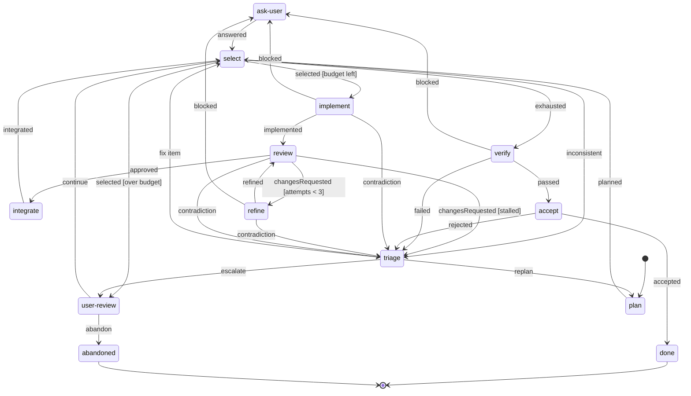

# Software delivery factory example

This example models an autonomous software **delivery** factory with Forge: one typed blueprint that takes a task from plan to accepted delivery, assembled with different kinds of workers.

> [!IMPORTANT]
> The probabilistic assembly runs end to end — see the Monte Carlo script below. The LLM assembly type-checks against the same blueprint but shells out to the Codex and Claude Code CLIs, and `forge run` is not implemented.

## The shape: an assembly line, not a dispatch hub

The blueprint in [`src/machine.ts`](./src/machine.ts) is an assembly line over a planned backlog. Work flows through a fixed per-item pipeline; exceptions drain into a triage funnel; humans sit at explicit authority boundaries.



The design rests on a handful of commitments:

- **LLM judgment is spent only where judgment exists.** Planning, implementing, reviewing, refining, verifying, and triage are model calls. Scheduling (`select`) and integration are deterministic policy in [`src/factories/policy.ts`](./src/factories/policy.ts) — picking the next ready backlog item is not a judgment call, so no tokens are spent on it.
- **Quality is a property of the graph; its cost scales with the stakes.** Review is unconditional after every implementation — no scheduler can skip it — but the reviewer tiers: trivial low-risk items get the deterministic quality gate (free), standard items a light model, high-risk items an adversarial cross-vendor review.
- **Loops are bounded by the machine.** The refine loop carries a guard (`attempts < 3`); its exhaustion is not an error but _evidence_, routed to triage. Endless review is unrepresentable.
- **Policy lives on edges, not stations.** The spend budget is a guarded transition out of `select` with a human fallback, not a task on the line. Stall detection dissolved into the refine bound entirely.
- **Friction is ambient, discretion is not.** Any working actor can report `blocked` (a question for the user) or `contradiction` (the work conflicts with the plan). Escape hatches are always reachable as _outcomes_, but never offered to a scheduler as _choices_.
- **Replanning is a funnel, not a whim.** Evidence of model-wrongness — refine exhaustion, contradictions, verification failure, an inconsistent backlog — drains into `triage`, which classifies once: fix one item, replan, or escalate to the human. A replan **amends** the backlog; integrated work is preserved.
- **Every station has a free floor.** Planning adopts a caller-supplied backlog without a model call; verification and acceptance drop to the gate and to policy when every item is gate-tier; scheduling and integration are always deterministic. The degenerate case — a caller (typically another agent) handing over one trivial item — costs exactly **one** model-grade call: zero overhead over asking an LLM directly. Spend meters model-grade work only, so the budget is a true token proxy.
- **Authority boundaries, not human boundaries:** questions (`ask-user`), funding and continuation (`user-review`), and final acceptance (`accept`) are held by whoever assembles them — a terminal human here, the calling agent in an agent-to-agent assembly, or policy for gate-tier deliveries. Answers persist as `decisions` that every later task reads.

## What this architecture is best for

**Spec'd delivery**: work that decomposes up front into items with acceptance criteria and dependencies — exactly the regime of a repository with a product spec and an accepted implementation order. Its goals are controlled shipping velocity, an enforced quality floor, bounded rework, and predictable token spend. Throughput is measurable (items integrated per budget unit) because the pipeline is fixed.

**What it is not best for**: open-ended exploration — research, debugging an unknown failure, work whose next step genuinely cannot be enumerated. There, a fixed pipeline fights the problem; a dispatch-hub topology (a resolver choosing the next capability each cycle) buys adaptability at the cost of tokens and structural looseness. The right response to that regime is a different blueprint over the same actors, not a looser version of this one. This machine also runs one item at a time by design; parallelism belongs at the assembly level (several factories over a shared backlog), not inside the blueprint.

## Why it beats the alternatives at delivery

- **vs. a dispatch hub** (this example's own previous shape): the hub re-decides "what kind of work happens next" with a planning-grade model call every cycle, quality is enforced by prompt rather than structure, and `resolve → review → resolve → review` is a legal walk. The line deletes the per-cycle scheduling call, makes review non-optional, and makes endless review unrepresentable. Same actors, roughly a third the transitions per item, and the two policy stations the hub needed (spend guard, stall detector) become a guard and a bound.
- **vs. a single agent loop**: one agent with tools owns control flow implicitly — there is no enforceable quality floor, no bounded rework, no typed contract on any step, and nothing to simulate. The blueprint makes the process durable and the workers disposable.
- **vs. a static script or CI pipeline**: a script has the discipline but no judgment — it cannot triage its own failure evidence, respec an item, or replan while preserving delivered work. The line keeps deterministic discipline where the work is deterministic and buys judgment only at the stations that need it.
- **vs. free multi-agent orchestration**: agent swarms negotiate control flow in conversation, which is unbounded in tokens and unverifiable in structure. Here coordination _is_ the state machine; the Monte Carlo below prices the whole topology before a single model call.

## One blueprint, two assemblies

### Probabilistic assembly

[`src/factories/probabilistic.ts`](./src/factories/probabilistic.ts) runs the line against a fixed six-item backlog (a dependency chain of mixed complexity and risk) with seeded probabilistic workers. Reviews model correlated failure — each refine attempt raises the odds of another rejection — so the bounded refine loop has something real to bound. Deterministic policy owns scheduling and integration for both assemblies.

Run the Monte Carlo:

```sh
bun run simulate
```

At 10,000 seeded runs with a budget of 25 model-grade work units: **~94% delivered**, ~6% abandoned, a mean spend of ~18, ~5.9 of 6 items integrated, and ~0.4 replans per run. The budget is a visible lever: most abandonment at budget 25 is the spend gate converting overrun tail-risk into human decisions — at budget 35 abandonment drops to ~2% while mean spend stays ~18, showing the demand is bounded with a refine-variance tail rather than runaway cost. The script also prints the degenerate case: a caller-supplied trivial item delivers at a spend of exactly 1.

### LLM assembly

[`src/factories/llm.ts`](./src/factories/llm.ts) assigns Codex models to planning, implementation (an escalation ladder by item complexity and retry count), refinement, verification, and triage; Claude Code reviews — independent evaluation deliberately runs on a different vendor than the implementers so it does not share their blind spots. Deterministic policy keeps scheduling and integration; terminal prompts keep questions, funding, and acceptance with the user.

Both assemblies satisfy the same actor contracts and assemble the same `DeliveryBlueprint`.

## Read the example

Start in this order:

1. [`src/schema.ts`](./src/schema.ts) — the backlog model, ambient `blocked`/`contradiction` outcomes, and boundary contracts.
2. [`src/actors.ts`](./src/actors.ts) — named capabilities and their typed inputs and outputs.
3. [`src/machine.ts`](./src/machine.ts) — the line, its guards, and how updates fold evidence into context.
4. [`src/factories/policy.ts`](./src/factories/policy.ts) — deterministic scheduling and integration.
5. [`src/factories/probabilistic.ts`](./src/factories/probabilistic.ts) — the simulation assembly.
6. [`src/factories/llm.ts`](./src/factories/llm.ts) — Codex, Claude Code, deterministic, and human implementations.

See the [`@forge/core` README](../../packages/core) for the library model and the [Forge README](../../README.md) for the project overview and prior work.
